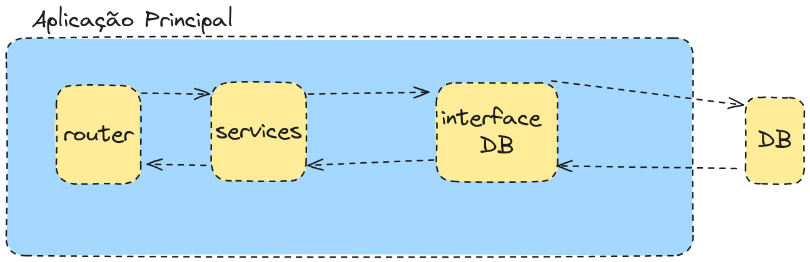

# AgroMap - Teste Tecnico para Dev Backend Python @ FITec

## Indice de Perguntas do Teste
 1. Descreva as etapas para executar configuração Inicial do Projeto
 2. Defina e escolha e Configuração do ORM
 3. Como versionar e organizar as migrações de Banco de Dados
 4. Defina a tecnologia e a forma de uso a Autenticação e Autorização
 5. Informe os métodos e ferramentas para gerar a Documentação da API
 6. Se necessário como deve ser tratada a integração com Outros Serviços
 7. Como corrigir e evitar erros de Configuração de Ambiente
 8. Quais os principais casos de problemas de Serialização/Deserialização
 9. Defina os critérios para criar uma consulta eficiente
 10. Como tratar o retorno de falhas de Transação
 11. Explique o formato correto de manipulação de Conexões de Dados
 12. Como evitar e tratar os Problemas de Concurrency
 13. Como deve ser feito o despejo e configuração de logs
 14. Defina a Modularização e Organização do Código
 15. Utilização de Dependências e Middleware para Reutilização de Código


### Introducao.
Para o desenvolvimento deste projeto, não temos muitas informações além de ser algo voltado para o 'Agronegócio e GEO'. Portanto, algumas decisões serão tomadas com base na minha experiência anterior.

Estou assumindo que os ambientes de desenvolvimento, homologação e produção estão rodando em um ambiente Debian com Docker instalado. O framework ASGI utilizado será o [FastAPI](https://fastapi.tiangolo.com/)

### Executando o Projeto

1. Faça o clone do projeto:
    ```bash
    git clone https://github.com/lucasbalieiro/agromap-fitec.git
    ```

2. Execute o comando para construir e iniciar os contêineres:
    ```bash
    docker compose up --build
    ```

3. Acesse a documentação da API no navegador:
    ```
    http://localhost:8000/docs
    ```

4. Para visualizar o relatório de cobertura de testes, abra o arquivo `index.html` em seu navegador:[index.html](./htmlcov/index.html)


### 1. Descreva as etapas para executar a configuração inicial do projeto

1. **Iniciar as configurações de versionamento**:
    - Configure o Git para o projeto:
      ```bash
      git init
      git remote add origin [URL_DO_REPOSITORIO]
      ```
    - Crie um arquivo `.gitignore` para ignorar arquivos e diretórios desnecessários.

2. **Iniciar o gerenciador de pacotes com os pacotes essenciais**:
    - Utilize o `pip` junto com os arquivos [`requirements.txt`](./requirements.txt) e [`requirements-dev.txt`](./requirements-dev.txt) para gerenciar as dependências do projeto.

3. **Criar um ambiente virtual local para o projeto**:
    - Recomendo usar `venv` pela simplicidade:
      ```bash
      python3 -m venv .venv
      source .venv/bin/activate
      pip install -r requirements.txt
      ```

4. **Configurar o Docker**:
    - Crie um [Dockerfile](./Dockerfile) para a imagem do backend.
    - Crie outro [Dockerfile](./db/Dockerfile) para a imagem do banco de dados PostgreSQL.
    - Configure o orquestramento dos contêineres usando [docker-compose.yml](./docker-compose.yml).

### 2. Defina a escolha e configuração do ORM

Meu ORM de escolha é o `SQLAlchemy` devido à sua facilidade de utilização, documentação abrangente e bom suporte da comunidade. 

Para a configuração do ORM, vou precisar de dois pacotes: `sqlalchemy==2.0.32` e `psycopg2-binary==2.9.9`. O `psycopg2-binary` será o driver que o `SQLAlchemy` utilizará para conectar e gerenciar as conexões e transações com o PostgreSQL.

Depois disso, vou criar uma função para conexão e retorno de uma sessão do banco de dados no arquivo [database.py](./app/config/database.py). Isso permitirá que eu reutilize essa função de conexão com mais facilidade e se adequará melhor à injeção de dependências do FastAPI.

### 3. Como versionar e organizar as migrações de Banco de Dados

Como estou utilizando o SQLAlchemy, é natural usar o `alembic` para versionar o banco de dados.

As configurações iniciais do `alembic` podem ser feitas através do comando:
```bash
alembic init alembic
```

Este comando gerará uma nova pasta chamada `alembic`, que será responsável por armazenar as versões do banco e algumas configurações do alembic. Outro arquivo importante gerado com esse comando, na raiz do diretório, é o `alembic.ini`.

Para as configurações do projeto, vamos alterar a configuração `sqlalchemy.url` (linha 63 de [alembic.ini](./alembic.ini)) para que, em vez de receber a URL do banco diretamente, agora receba através da variável de ambiente configurada no arquivo `.env`.

Além disso, será necessário adicionar as linhas 12 e 13 de [alembic/env.py](./alembic/env.py) para fazer o replace do valor da variável de ambiente no arquivo `alembic.ini`.

 ### 4. Defina a tecnologia e a forma de uso da Autenticação e Autorização

Para a autenticação, podemos usar JWT (JSON Web Token) por ser leve, padronizado, bem documentado e não precisar manter nenhum estado no servidor. 

Para implementar isso, vou utilizar os pacotes `passlib[bcrypt]==1.7.4` e `python-jose[cryptography]==3.3.0`. O primeiro será usado para criptografar a senha do usuário, e o segundo será usado para criar, decodificar e validar o JWT.

Para as rotas que precisam de autenticação, utilizarei o recurso `Depends` do FastAPI. Qualquer rota que necessitar de autenticação deverá executar a classe [JWTBearer](./app/services/auth/auth_bearer.py). Essa classe verificará o esquema de autenticação e decodificará o JWT para verificar se é válido ou não. Caso não seja válido, retornará o status HTTP 403.

Outro passo importante para a autenticação é a forma como as credenciais do usuário são salvas no banco. A senha do usuário, antes de ser salva no banco, é criptografada usando uma função hash `hash_password` em [app/services/security/password.py](./app/services/security/password.py).

A lógica de geração do Token JWT pode ser encontrada em [authenticate_user_service.py](./app/services/auth/authenticate_user_service.py). Basicamente, uma vez que as informações de usuário e senha são validadas, a função [`create_access_token`](./app/services/security/tokens.py) é chamada. Esta função será responsável por fazer o encoding do payload do Token, configurar a data de expiração com base na variável de ambiente `JWT_ACCESS_TOKEN_EXPIRE_MINUTES` e calcular a assinatura do Token utilizando os parâmetros configurados nas variáveis `JWT_SECRET_KEY` e `JWT_ALGORITHM`.

 ### 5. Informe os métodos e ferramentas para gerar a Documentação da API

Uma das grandes vantagens do FastAPI é que ele gera documentação de forma automática, com base nos parâmetros das rotas e dos schemas utilizando o Pydantic. Para acessar a documentação gerada pelo Swagger, basta acessar:
```
http://localhost:8000/docs
```

Como o Swagger segue o padrão OpenAPI, é possível baixar o schema em JSON e integrá-lo diretamente em um cliente HTTP, como Postman ou Insomnia:
```
http://localhost:8000/openapi.json
```

Além disso, essa facilidade permite gerar clientes em diversas linguagens, o que pode simplificar o trabalho do pessoal do frontend. Uma das ferramentas que pode ser utilizada para essa finalidade é o [openapi-generator](https://openapi-generator.tech/).

### 6. Se necessário, como deve ser tratada a integração com Outros Serviços

Para a integração com outros serviços, é uma boa prática abstrair essas integrações. Isso ajuda a evitar que o código e a lógica de negócios da aplicação fiquem altamente acoplados a uma ferramenta de terceiros. Um alto acoplamento pode dificultar os testes unitários e adicionar uma camada de dependência muito alta de um serviço externo, o que não é ideal.

Vou utilizar a mesma abordagem que usei para a conexão com o banco de dados nesta aplicação. Abaixo está um exemplo de como tratei a integração com um repositório de usuários:



Observando o serviço de consulta de usuário por ID, você pode notar que ele recebe um parâmetro chamado `user_repository: IUserRepository`. Esse parâmetro pode ser uma instância de qualquer objeto que implemente essa interface:
```python
def execute(user_id: UUID, user_repository: IUserRepository):
    user = user_repository.get_by_id(user_id)

    if not user:
        raise BusinessLogicError("User not found", error_type=ErrorType.NOT_FOUND)

    return user
```

No projeto, implementei duas versões diferentes dessa interface de repositório. Uma delas comunica-se com o PostgreSQL, e a outra gerencia um array em memória, que é útil para testes unitários. Dessa forma, não preciso ter uma conexão real com o banco durante os testes unitários, já que isso se configuraria como um teste de integração:
```text
app/repositories/
├── dependencies.py
├── implementations
│   ├── __init__.py
│   ├── role_repository_sqlalchemy.py
│   └── user_repository_sqlalchemy.py
├── interfaces
│   ├── __init__.py
│   ├── role_repository_interface.py
│   └── user_repository_interface.py
└── mocks
    ├── __init__.py
    ├── role_repository_mock.py
    └── user_repository_mock.py
```

Seguindo essa estratégia, o código se torna muito mais testável e modular, com menos acoplamento. Essa abordagem pode ser aplicada a outros serviços, como a verificação de clima. Por exemplo, se o AgroMap precisar de informações climáticas de um site como [AccuWeather](https://www.accuweather.com/), eu poderia criar uma interface que me permitiria não apenas mockar o site para fins de testes unitários, mas também facilitar a troca do provedor de informações, caso necessário. Todo provedor seria chamado pela mesma interface.

Essa abordagem também abstrai a forma de comunicação entre o provedor e a aplicação, permitindo que a aplicação não precise saber se a comunicação é feita via uma requisição HTTP padrão ou uma consulta via WebSocket para o provedor de informações.


 ### 7. Como corrigir e evitar erros de Configuração de Ambiente

Boa parte dos erros de configuração de ambiente podem ser resolvidos utilizando algumas práticas e tecnologias:

- **Docker**: Utilizar Docker ajuda a garantir que os ambientes entre as máquinas dos desenvolvedores sigam o mesmo padrão, evitando o famoso "Na minha máquina funciona". Ao definir containers para o ambiente de desenvolvimento, homologação e produção, você pode garantir que todos os ambientes sejam consistentes e reproduzíveis.

- **Definição explícita de variáveis de ambiente**: É uma boa prática definir variáveis de ambiente de forma explícita. Normalmente, uso um arquivo chamado `.env` na raiz do projeto para definir essas variáveis. Para maior consistência e facilidade de uso, atrelo a leitura desse arquivo a um esquema do `pydantic`. Isso assegura que as variáveis sejam lidas e validadas corretamente, e que o código que depende delas esteja em conformidade com o esquema definido.


Ao utilizar o `pydantic` para validar as variáveis de ambiente, você pode garantir que todos os valores necessários estejam presentes e corretos antes que o aplicativo comece a executar. Isso ajuda a evitar erros de configuração e facilita a depuração.

### 8. Quais os principais casos de problemas de Serialização/Deserialização

Os principais problemas que enfrento com serialização e deserialização incluem:

- **Incompatibilidade dos Dados**: Dados recebidos de uma fonte externa podem não estar no formato esperado ou podem conter erros, o que leva a falhas na serialização ou deserialização.

- **Ausência de Campos Obrigatórios**: Isso é particularmente comum em linguagens que não são fortemente tipadas, como Python. A ausência de campos obrigatórios pode causar falhas durante o processamento dos dados.

- **Aninhamento Complexo de Dados**: Dados altamente aninhados podem ser difíceis de entender e manipular. A complexidade do aninhamento pode levar a erros durante a deserialização e tornar a validação mais desafiadora.

O FastAPI, por padrão, integra-se fortemente com o `pydantic`, o que ajuda a mitigar muitos desses problemas. O `pydantic` fornece validação e serialização robustas, ajudando a garantir que os dados estejam no formato correto antes que sejam processados.

Além disso, o `pydantic` possui uma boa integração com os modelos do SQLAlchemy. A conversão entre modelos SQLAlchemy e objetos `pydantic` pode ser gerenciada de forma eficiente, especialmente quando se utiliza a opção `"from_attributes": True` ao criar esquemas `pydantic` a partir de modelos SQLAlchemy.


### 9. Defina os critérios para criar uma consulta eficiente

Para criar consultas eficientes, considere os seguintes critérios:

- **Paginação**: Utilize `limit` e `offset` para implementar a paginação. Isso é fundamental para consultas que retornam grandes volumes de dados, pois reduz a quantidade de dados retornados por vez e melhora o desempenho.

- **Cache**: Adicione uma camada de cache para consultas repetitivas. Isso pode ser feito utilizando soluções como Redis ou Memcached para armazenar os resultados de consultas frequentemente solicitadas, reduzindo a carga no banco de dados e melhorando o tempo de resposta.

- **Indexação**: Indexe os campos mais consultados para acelerar a recuperação de dados. A criação de índices apropriados pode significativamente melhorar o desempenho das consultas, especialmente em grandes volumes de dados.

- **Views Materializadas**: Crie views materializadas para consultas frequentes que não precisam ser atualizadas em tempo real. Views materializadas armazenam o resultado da consulta em disco, permitindo acesso rápido aos dados pré-calculados.

- **Full-Text Search**: Para endpoints que realizam buscas por termos, habilite o full-text search. No PostgreSQL, você pode usar o `b-tree-GiST` para otimizar buscas textuais. O full-text search permite consultas eficientes em grandes volumes de texto, e o uso de índices especializados melhora a performance. O [Fabio Akita](https://www.youtube.com/watch?v=-yGHG3pnHLg) tem um excelente vídeo sobre como configurar e otimizar buscas textuais no PostgreSQL.

### 10. Como tratar o retorno de falhas de Transação

Para tratar falhas de transação de forma eficiente, considere os seguintes passos:

1. **Blocos de `try ... except`**: Utilize blocos `try ... except` para capturar e tratar exceções que ocorrem durante operações de banco de dados. Isso é crucial para lidar com inconsistências e falhas de comunicação.

2. **Rollback**: Em caso de erro durante a transação, execute um rollback para reverter quaisquer alterações feitas até o ponto da falha. Isso assegura que o banco de dados permaneça em um estado consistente.

3. **Registro e Relance de Erros**: Após realizar o rollback, registre o erro para análise e diagnóstico futuros. Em seguida, relance a exceção para garantir que a falha seja propagada adequadamente e que o sistema que chamou a transação possa lidar com o erro de forma apropriada.

**Exemplo de Tratamento de Falhas de Transação**:
```python
from sqlalchemy.exc import SQLAlchemyError

def add_item(db_session, item):
    try:
        db_session.add(item)
        db_session.commit()
        db_session.refresh(item)
        return item
    except SQLAlchemyError as e:
        db_session.rollback()
        print(f"Error occurred: {e}")
        raise
```

Ao tratar erros de transação de forma adequada, você melhora a robustez e a confiabilidade do seu sistema, garantindo que ele possa lidar com falhas de forma eficiente e fornecer feedback apropriado sobre o que deu errado.

### 11 Explique o formato correto de manipulação de Conexões de Dados

Normalmente, utilizo o gerenciador de conexões do SQLAlchemy em conjunto com o injetor de dependência do FastAPI. Nos casos mais específicos em que preciso de controle mais detalhado, emprega-se um gerenciador de contexto para abrir a conexão, realizar as operações necessárias e, posteriormente, garantir que a conexão seja encerrada de forma adequada e segura.

### 12. Como evitar e tratar problemas de concorrência

Operações envolvendo concorrência devem ser manejadas com muito cuidado para evitar condições de corrida (race conditions). Tive dificuldades com isso anteriormente ao usar SQLite com multithreading. No entanto, existem maneiras de mitigar esses problemas.

No Python, podemos usar a classe `threading.Lock` para bloquear recursos enquanto uma thread está utilizando-os, liberando-os apenas após o processamento. Além disso, é possível utilizar [queues](https://docs.python.org/3/library/queue.html), que, conforme a documentação, são bastante úteis para comunicação entre threads.

Aqui está uma versão melhorada da mensagem:

### 13. Como deve ser feito o despejo e configuração de logs

Costumo usar a biblioteca `logging` do Python para o gerenciamento de logs. Um exemplo de configuração pode ser encontrado [aqui](./app/config/logger.py). Essa biblioteca permite configurar um arquivo de saída para centralizar todos os logs em um único lugar. Utilizar `logging` em vez de vários `print` é mais recomendado, pois o `logging` é thread-safe, ao contrário do `print`, que depende do `stdout` do sistema.

Além disso, pode ser útil integrar com centralizadores de log compatíveis com OpenTelemetry, como Grafana, e realizar consultas através do Prometheus.

Aqui está uma versão melhorada da mensagem sobre modularização e organização do código:

---

### 14. Definição de Modularização e Organização do Código

O código foi desenvolvido com foco na separação de responsabilidades para garantir modularidade e testabilidade. A estrutura de pastas é organizada da seguinte forma:

```text
.
├── alembic                # Configurações e versionamento do gerenciador de migrations
│   └── versions
├── app                    # Pasta principal da aplicação
│   ├── config             # Arquivos de configuração: conexão com o banco, leitura de variáveis de ambiente e loggers
│   ├── error              # Exceções personalizadas da aplicação
│   ├── models             # Modelos utilizados pelo SQLAlchemy
│   ├── repositories       # Camada de comunicação com o banco, incluindo interfaces e mocks
│   │   ├── implementations
│   │   ├── interfaces
│   │   └── mocks
│   ├── routes             # Rotas do FastAPI
│   ├── schemas            # Schemas do Pydantic para validação e serialização de dados
│   └── services           # Regras de negócio da aplicação
│       ├── auth
│       ├── roles
│       ├── security
│       └── users
├── db                     # Configurações iniciais do banco no Docker
├── docs                   # Documentação e assets relacionados
│   └── assets
└── tests                  # Testes unitários
    └── unit               # Testes unitários cobrindo a camada de serviços
```

Essa organização permite uma manutenção mais fácil, facilita a colaboração e melhora a capacidade de teste da aplicação.


### 15. Utilização de Dependências e Middleware para Reutilização de Código

Esta parte foi abordada anteriormente, especialmente na seção de autenticação, onde a classe `JWTBearer` valida todas as requisições para rotas que requerem autenticação.

Outro middleware utilizado está disponível em [main.py](./app/main.py), e é responsável pelo controle do CORS:

```python
application.add_middleware(
    CORSMiddleware,
    allow_origins=["*"],
    allow_credentials=True,
    allow_methods=["*"],
    allow_headers=["*"],
)
```

Embora não tenha sido implementado no projeto, seria possível criar um middleware personalizado, como o exemplo abaixo:

```python
@application.middleware("http")
async def custom_middleware_agromap(request: Request, call_next):
    response = await call_next(request)
    token = request.headers.get("Authorization")
    if token:
        try:
            token = token.split(" ")[1]
            payload = tokens.decode_access_token(token)
            new_token = tokens.create_access_token(payload)
            response.headers["X-Set-Token"] = new_token
            response.headers["access-control-expose-headers"] = "X-Set-Token"

        except Exception:
            return response
    return response
```

Este middleware poderia ser utilizado para atualizar tokens e adicionar cabeçalhos personalizados às respostas, se necessário.